# **构建CameraX应用**

## 创建一个Empty Activity项目

选择创建一个Empty Activity，选择Kotlin语言，命名应用程序CameraXApp，

并最小支持API Level 21

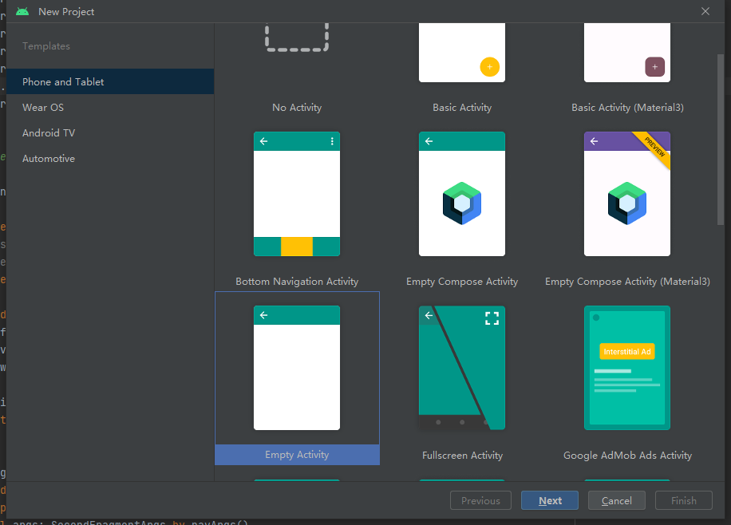

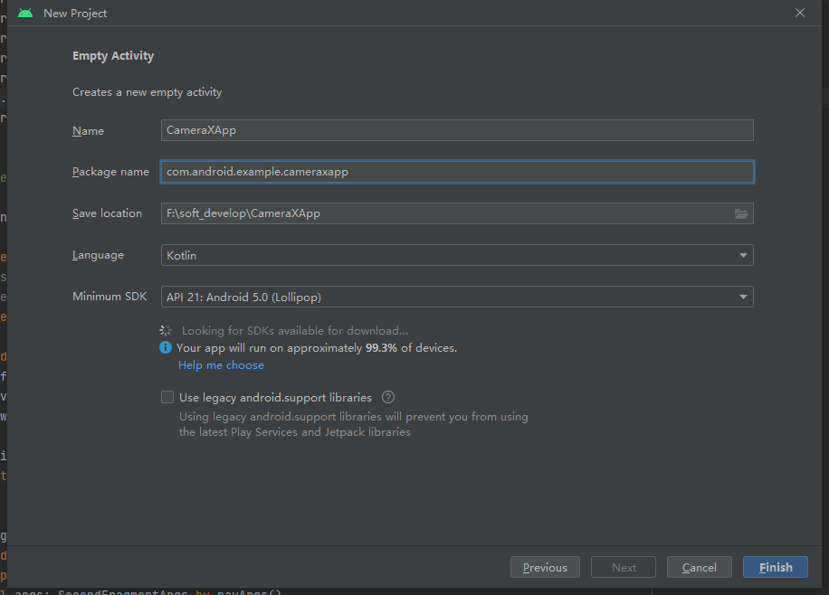


## 添加 Gradle 依赖

打开项目的模块（Module）的build.gradle 文件，并添加 CameraX 依赖项

```build.gradle
dependencies {
  def camerax_version = "1.1.0-beta01"
  implementation "androidx.camera:camera-core:${camerax_version}"
  implementation "androidx.camera:camera-camera2:${camerax_version}"
  implementation "androidx.camera:camera-lifecycle:${camerax_version}"
  implementation "androidx.camera:camera-video:${camerax_version}"
  implementation "androidx.camera:camera-view:${camerax_version}"
  implementation "androidx.camera:camera-extensions:${camerax_version}"
}
```


在 android{} 代码块末尾添加如下代码：

```
buildFeatures {
   viewBinding true
}
```


## 创建项目布局

本项目中，涉及以下的功能：

CameraX PreviewView（用于预览相机图片/视频）。
用于控制图片拍摄的标准按钮。
用于开始/停止视频拍摄的标准按钮。
用于放置 2 个按钮的垂直指南。
打开res/layout/activity_main.xml 的 activity_main 布局文件，并将其替换为以下代码。

```kotlin
<?xml version="1.0" encoding="utf-8"?>
<androidx.constraintlayout.widget.ConstraintLayout
   xmlns:android="http://schemas.android.com/apk/res/android"
   xmlns:app="http://schemas.android.com/apk/res-auto"
   xmlns:tools="http://schemas.android.com/tools"
   android:layout_width="match_parent"
   android:layout_height="match_parent"
   tools:context=".MainActivity">

   <androidx.camera.view.PreviewView
       android:id="@+id/viewFinder"
       android:layout_width="match_parent"
       android:layout_height="match_parent" />

   <Button
       android:id="@+id/image_capture_button"
       android:layout_width="110dp"
       android:layout_height="110dp"
       android:layout_marginBottom="50dp"
       android:layout_marginEnd="50dp"
       android:elevation="2dp"
       android:text="@string/take_photo"
       app:layout_constraintBottom_toBottomOf="parent"
       app:layout_constraintLeft_toLeftOf="parent"
       app:layout_constraintEnd_toStartOf="@id/vertical_centerline" />

   <Button
       android:id="@+id/video_capture_button"
       android:layout_width="110dp"
       android:layout_height="110dp"
       android:layout_marginBottom="50dp"
       android:layout_marginStart="50dp"
       android:elevation="2dp"
       android:text="@string/start_capture"
       app:layout_constraintBottom_toBottomOf="parent"
       app:layout_constraintStart_toEndOf="@id/vertical_centerline" />

   <androidx.constraintlayout.widget.Guideline
       android:id="@+id/vertical_centerline"
       android:layout_width="wrap_content"
       android:layout_height="wrap_content"
       android:orientation="vertical"
       app:layout_constraintGuide_percent=".50" />

</androidx.constraintlayout.widget.ConstraintLayout>

```

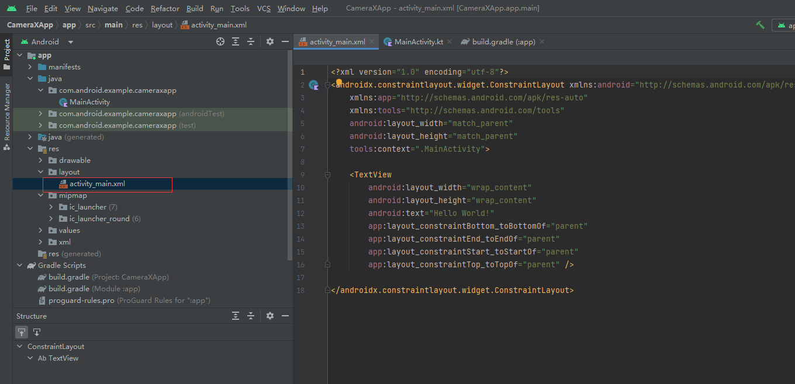

更新res/values/strings.xml 文件

```kotlin
<resources>
    <string name="app_name">CameraXApp</string>
    <string name="take_photo">Take Photo</string>
    <string name="start_capture">Start Capture</string>
    <string name="stop_capture">Stop Capture</string>
</resources>

```


布局界面效果如图

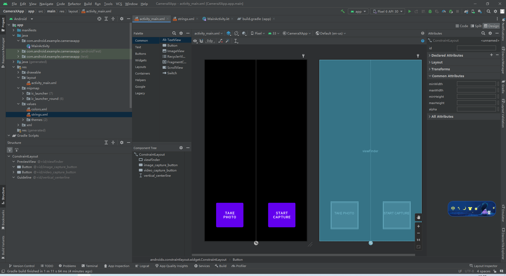


## 编写 MainActivity.kt 代码


将 MainActivity.kt 中的代码替换为以下代码，但保留软件包名称不变。它包含 import 语句、将要实例化的变量、要实现的函数以及常量。

系统已实现 onCreate()，供我们检查相机权限、启动相机、为照片和拍摄按钮设置 onClickListener()，以及实现 cameraExecutor。虽然系统已经实现 onCreate()，但在实现文件中的方法之前，相机将无法正常工作。


```kotlin
package com.android.example.cameraxapp

import android.Manifest
import android.content.ContentValues
import android.content.pm.PackageManager
import android.os.Build
import android.os.Bundle
import android.provider.MediaStore
import androidx.appcompat.app.AppCompatActivity
import androidx.camera.core.ImageCapture
import androidx.camera.video.Recorder
import androidx.camera.video.Recording
import androidx.camera.video.VideoCapture
import androidx.core.app.ActivityCompat
import androidx.core.content.ContextCompat
import com.android.example.cameraxapp.databinding.ActivityMainBinding
import java.util.concurrent.ExecutorService
import java.util.concurrent.Executors
import android.widget.Toast
import androidx.camera.lifecycle.ProcessCameraProvider
import androidx.camera.core.Preview
import androidx.camera.core.CameraSelector
import android.util.Log
import androidx.camera.core.ImageAnalysis
import androidx.camera.core.ImageCaptureException
import androidx.camera.core.ImageProxy
import androidx.camera.video.FallbackStrategy
import androidx.camera.video.MediaStoreOutputOptions
import androidx.camera.video.Quality
import androidx.camera.video.QualitySelector
import androidx.camera.video.VideoRecordEvent
import androidx.core.content.PermissionChecker
import java.nio.ByteBuffer
import java.text.SimpleDateFormat
import java.util.Locale

typealias LumaListener = (luma: Double) -> Unit

class MainActivity : AppCompatActivity() {
    private lateinit var viewBinding: ActivityMainBinding

    private var imageCapture: ImageCapture? = null

    private var videoCapture: VideoCapture<Recorder>? = null
    private var recording: Recording? = null

    private lateinit var cameraExecutor: ExecutorService

    override fun onCreate(savedInstanceState: Bundle?) {
        super.onCreate(savedInstanceState)
        viewBinding = ActivityMainBinding.inflate(layoutInflater)
        setContentView(viewBinding.root)

        // Request camera permissions
        if (allPermissionsGranted()) {
            startCamera()
        } else {
            ActivityCompat.requestPermissions(
                this, REQUIRED_PERMISSIONS, REQUEST_CODE_PERMISSIONS)
        }

        // Set up the listeners for take photo and video capture buttons
        viewBinding.imageCaptureButton.setOnClickListener { takePhoto() }
        viewBinding.videoCaptureButton.setOnClickListener { captureVideo() }

        cameraExecutor = Executors.newSingleThreadExecutor()
    }

    private fun takePhoto() {}

    private fun captureVideo() {}

    private fun startCamera() {}

    private fun allPermissionsGranted() = REQUIRED_PERMISSIONS.all {
        ContextCompat.checkSelfPermission(
            baseContext, it) == PackageManager.PERMISSION_GRANTED
    }

    override fun onDestroy() {
        super.onDestroy()
        cameraExecutor.shutdown()
    }

    companion object {
        private const val TAG = "CameraXApp"
        private const val FILENAME_FORMAT = "yyyy-MM-dd-HH-mm-ss-SSS"
        private const val REQUEST_CODE_PERMISSIONS = 10
        private val REQUIRED_PERMISSIONS =
            mutableListOf (
                Manifest.permission.CAMERA,
                Manifest.permission.RECORD_AUDIO
            ).apply {
                if (Build.VERSION.SDK_INT <= Build.VERSION_CODES.P) {
                    add(Manifest.permission.WRITE_EXTERNAL_STORAGE)
                }
            }.toTypedArray()
    }
}

```

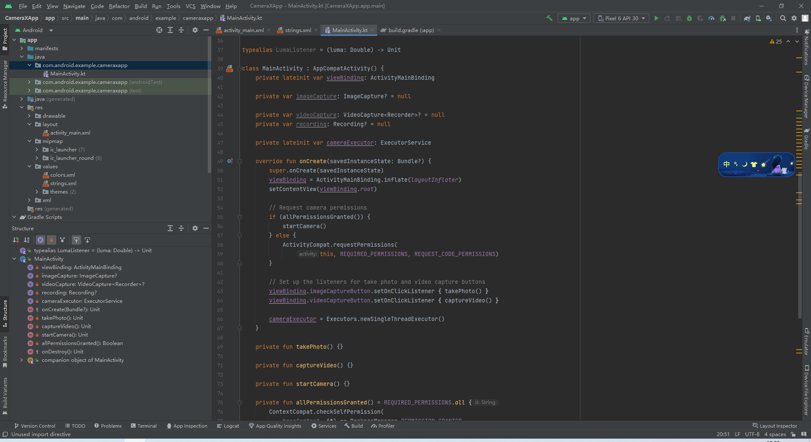

## 请求必要的权限

应用需要获得用户授权才能打开相机；录制音频也需要麦克风权限；在 Android 9 § 及更低版本上，MediaStore 需要外部存储空间写入权限。在此步骤中，我们将实现这些必要的权限。

打开 AndroidManifest.xml，然后将以下代码行添加到 application 标记之前。


添加 android.hardware.camera.any 可确保设备配有相机。指定 .any 表示它可以是前置摄像头，也可以是后置摄像头。

> 如果在未指定 .any 的情况下使用 android.hardware.camera，并且设备未配有后置摄像头（例如大多数 Chromebook），那么相机将无法正常运行。第二行代码会添加对该相机的使用权限。
> 


然后，复制代码到MainActivity.kt. 中。

```kotlin
override fun onRequestPermissionsResult(
   requestCode: Int, permissions: Array<String>, grantResults:
   IntArray) {
    super.onRequestPermissionsResult(requestCode, permissions, grantResults)
   if (requestCode == REQUEST_CODE_PERMISSIONS) {
       if (allPermissionsGranted()) {
           startCamera()
       } else {
           Toast.makeText(this,
               "Permissions not granted by the user.",
               Toast.LENGTH_SHORT).show()
           finish()
       }
   }
}

```


效果如下图所示：

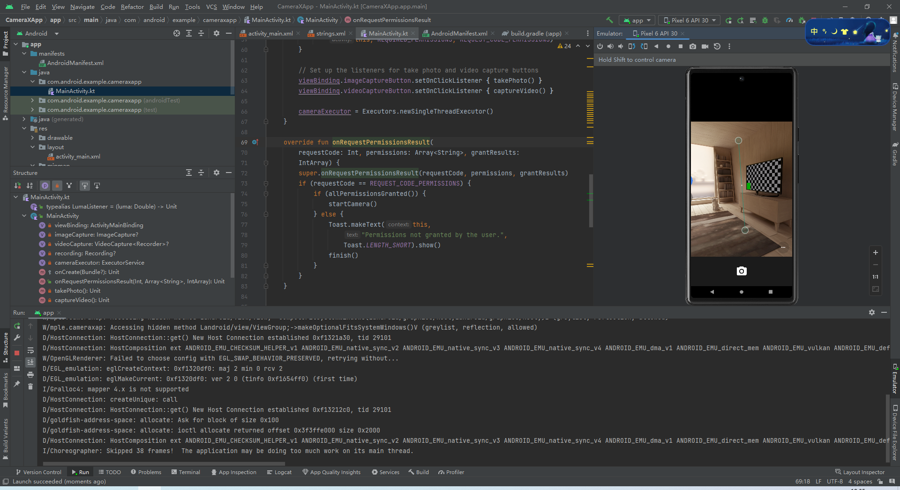

## 实现 Preview 用例

在相机应用中，取景器用于让用户预览他们拍摄的照片。我们将使用 CameraX Preview 类实现取景器。

如需使用 Preview，首先需要定义一个配置，然后系统会使用该配置创建用例的实例。生成的实例就是绑定到 CameraX 生命周期的内容。填充之前的startCamera() 函数


```kotlin
private fun startCamera() {
   val cameraProviderFuture = ProcessCameraProvider.getInstance(this)

   cameraProviderFuture.addListener({
       // Used to bind the lifecycle of cameras to the lifecycle owner
       val cameraProvider: ProcessCameraProvider = cameraProviderFuture.get()

       // Preview
       val preview = Preview.Builder()
          .build()
          .also {
              it.setSurfaceProvider(viewBinding.viewFinder.surfaceProvider)
          }

       // Select back camera as a default
       val cameraSelector = CameraSelector.DEFAULT_BACK_CAMERA

       try {
           // Unbind use cases before rebinding
           cameraProvider.unbindAll()

           // Bind use cases to camera
           cameraProvider.bindToLifecycle(
               this, cameraSelector, preview)

       } catch(exc: Exception) {
           Log.e(TAG, "Use case binding failed", exc)
       }

   }, ContextCompat.getMainExecutor(this))
}

```


以下分析上述代码。创建 ProcessCameraProvider 的实例。这用于将相机的生命周期绑定到生命周期所有者。这消除了打开和关闭相机的任务，因为 CameraX 具有生命周期感知能力

```
val cameraProviderFuture = ProcessCameraProvider.getInstance(this)

```

向 cameraProviderFuture 添加监听器。添加 Runnable 作为一个参数。添加 ContextCompat.getMainExecutor() 作为第二个参数。这将返回一个在主线程上运行的 Executor。其具体形式：

```
cameraProviderFuture.addListener(Runnable {}, ContextCompat.getMainExecutor(this))

```

在 Runnable 中，添加 ProcessCameraProvider。它用于将相机的生命周期绑定到应用进程中的 LifecycleOwner。

```
val cameraProvider: ProcessCameraProvider = cameraProviderFuture.get()

```


初始化 Preview 对象，在其上调用 build，从取景器中获取 Surface 提供程序，然后在预览上进行设置。

```
val preview = Preview.Builder()
   .build()
   .also {
       it.setSurfaceProvider(viewBinding.viewFinder.surfaceProvider)
   }

```

创建 CameraSelector 对象，然后选择 DEFAULT_BACK_CAMERA。

```
val cameraSelector = CameraSelector.DEFAULT_BACK_CAMERA

```

创建一个 try 代码块。在此块内，确保没有任何内容绑定到 cameraProvider，然后将 cameraSelector 和预览对象绑定到 cameraProvider。

```
try {
   cameraProvider.unbindAll()
   cameraProvider.bindToLifecycle(
       this, cameraSelector, preview)
}

```

有多种原因可能会导致此代码失败，例如应用不再获得焦点。将此代码封装到 catch 块中，以便在出现故障时记录日志。

```
catch(exc: Exception) {
      Log.e(TAG, "Use case binding failed", exc)
}

```

用了自己手机试了一下，通过开发者工具实现USB调试(系统更新->开发人员选项->USB调试)，然后下载了CameraXApp该应用程序，弹出如下：

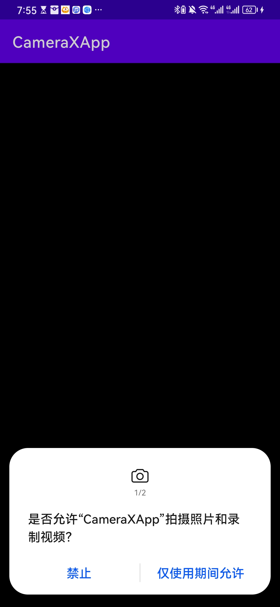


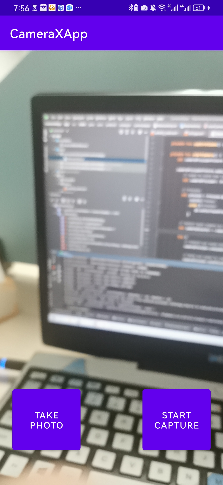

## 实现 ImageCapture 用例（拍照功能）

其他用例与 Preview 非常相似。首先，定义一个配置对象，该对象用于实例化实际用例对象。若要拍摄照片，需要实现 takePhoto() 方法，该方法会在用户按下 photo 按钮时调用。填充takePhoto() 方法的代码：

```kotlin
private fun takePhoto() {
   // Get a stable reference of the modifiable image capture use case
   val imageCapture = imageCapture ?: return

   // Create time stamped name and MediaStore entry.
   val name = SimpleDateFormat(FILENAME_FORMAT, Locale.US)
              .format(System.currentTimeMillis())
   val contentValues = ContentValues().apply {
       put(MediaStore.MediaColumns.DISPLAY_NAME, name)
       put(MediaStore.MediaColumns.MIME_TYPE, "image/jpeg")
       if(Build.VERSION.SDK_INT > Build.VERSION_CODES.P) {
           put(MediaStore.Images.Media.RELATIVE_PATH, "Pictures/CameraX-Image")
       }
   }

   // Create output options object which contains file + metadata
   val outputOptions = ImageCapture.OutputFileOptions
           .Builder(contentResolver,
                    MediaStore.Images.Media.EXTERNAL_CONTENT_URI,
                    contentValues)
           .build()

   // Set up image capture listener, which is triggered after photo has
   // been taken
   imageCapture.takePicture(
       outputOptions,
       ContextCompat.getMainExecutor(this),
       object : ImageCapture.OnImageSavedCallback {
           override fun onError(exc: ImageCaptureException) {
               Log.e(TAG, "Photo capture failed: ${exc.message}", exc)
           }

           override fun
               onImageSaved(output: ImageCapture.OutputFileResults){
               val msg = "Photo capture succeeded: ${output.savedUri}"
               Toast.makeText(baseContext, msg, Toast.LENGTH_SHORT).show()
               Log.d(TAG, msg)
           }
       }
   )
}

```


首先，获取对 ImageCapture 用例的引用。如果用例为 null，退出函数。如果在设置图片拍摄之前点按“photo”按钮，它将为 null。如果没有 return 语句，应用会在该用例为 null 时崩溃。

val imageCapture = imageCapture ?: return

接下来，创建用于保存图片的 MediaStore 内容值。使用时间戳，确保 MediaStore 中的显示名是唯一的。

val name = SimpleDateFormat(FILENAME_FORMAT, Locale.US)
              .format(System.currentTimeMillis())
   val contentValues = ContentValues().apply {
       put(MediaStore.MediaColumns.DISPLAY_NAME, name)
       put(MediaStore.MediaColumns.MIME_TYPE, "image/jpeg")
       if(Build.VERSION.SDK_INT > Build.VERSION_CODES.P) {
           put(MediaStore.Images.Media.RELATIVE_PATH, "Pictures/CameraX-Image")
       }
   }


创建一个 OutputFileOptions 对象。在该对象中，可以指定所需的输出内容。我们希望将输出保存在 MediaStore 中，以便其他应用可以显示它，因此，添加 MediaStore 条目。

val outputOptions = ImageCapture.OutputFileOptions
       .Builder(contentResolver,
                MediaStore.Images.Media.EXTERNAL_CONTENT_URI,
                contentValues)
       .build()


对 imageCapture 对象调用 takePicture()。传入 outputOptions、执行器和保存图片时使用的回调。接下来，需要完成回调

imageCapture.takePicture(   outputOptions, ContextCompat.getMainExecutor(this),   object : ImageCapture.OnImageSavedCallback {} )


override fun onError(exc: ImageCaptureException) {
   Log.e(TAG, "Photo capture failed: ${exc.message}", exc)
}


如果拍摄未失败，即表示照片拍摄成功！将照片保存到之前创建的文件中，显示消息框，让用户知道照片已拍摄成功，并输出日志语句。


override fun onImageSaved(output: ImageCapture.OutputFileResults) {
   val savedUri = Uri.fromFile(photoFile)
   val msg = "Photo capture succeeded: $savedUri"
   Toast.makeText(baseContext, msg, Toast.LENGTH_SHORT).show()
   Log.d(TAG, msg)
}

找到 startCamera() 方法，并将此代码复制到要预览的代码下方。.

imageCapture = ImageCapture.Builder().build()

最后，在 try 代码块中更新对 bindToLifecycle() 的调用，以包含新的用例：

cameraProvider.bindToLifecycle(   this, cameraSelector, preview, imageCapture)


此时，该方法将如下所示：


    private fun startCamera() {
       val cameraProviderFuture = ProcessCameraProvider.getInstance(this)
    
       cameraProviderFuture.addListener({
           // Used to bind the lifecycle of cameras to the lifecycle owner
           val cameraProvider: ProcessCameraProvider = cameraProviderFuture.get()
    
           // Preview
           val preview = Preview.Builder()
               .build()
               .also {
                     it.setSurfaceProvider(viewFinder.surfaceProvider)
               }
    
           imageCapture = ImageCapture.Builder()
               .build()
    
           // Select back camera as a default
           val cameraSelector = CameraSelector.DEFAULT_BACK_CAMERA
    
           try {
               // Unbind use cases before rebinding
               cameraProvider.unbindAll()
    
               // Bind use cases to camera
               cameraProvider.bindToLifecycle(
                   this, cameraSelector, preview, imageCapture)
    
           } catch(exc: Exception) {
               Log.e(TAG, "Use case binding failed", exc)
           }
    
       }, ContextCompat.getMainExecutor(this))
    }
    

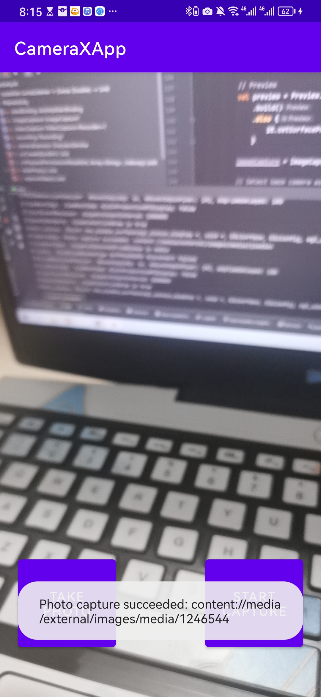  

这时可以查看本地的图片库，查看刚刚拍摄的图片。


## 实现 ImageAnalysis 用例

使用 ImageAnalysis 功能可让相机应用变得更加有趣。它允许定义实现 ImageAnalysis.Analyzer 接口的自定义类，并使用传入的相机帧调用该类。无需管理相机会话状态，甚至无需处理图像；与其他生命周期感知型组件一样，仅绑定到应用所需的生命周期就足够了。


将此分析器添加为 MainActivity.kt 中的内部类。分析器会记录图像的平均亮度。如需创建分析器，我们会替换实现 ImageAnalysis.Analyzer 接口的类中的 analyze 函数。

```kotlin
private class LuminosityAnalyzer(private val listener: LumaListener) : ImageAnalysis.Analyzer {

   private fun ByteBuffer.toByteArray(): ByteArray {
       rewind()    // Rewind the buffer to zero
       val data = ByteArray(remaining())
       get(data)   // Copy the buffer into a byte array
       return data // Return the byte array
   }

   override fun analyze(image: ImageProxy) {

       val buffer = image.planes[0].buffer
       val data = buffer.toByteArray()
       val pixels = data.map { it.toInt() and 0xFF }
       val luma = pixels.average()

       listener(luma)

       image.close()
   }
}

```

在类中实现 ImageAnalysis.Analyzer 接口后，只需在 ImageAnalysis中实例化一个 LuminosityAnalyzer 实例（与其他用例类似），并再次更新 startCamera() 函数，然后调用 CameraX.bindToLifecycle() 即可：
接下来更新startCamera()，将以下代码添加到 imageCapture 代码下方。

```kotlin
val imageAnalyzer = ImageAnalysis.Builder()
   .build()
   .also {
       it.setAnalyzer(cameraExecutor, LuminosityAnalyzer { luma ->
           Log.d(TAG, "Average luminosity: $luma")
       })
   }

```

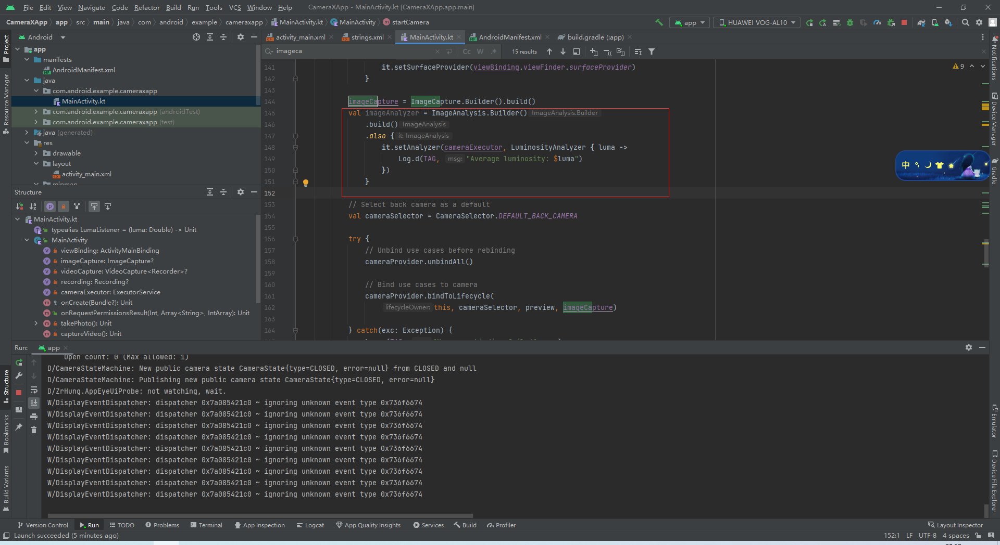

更新 cameraProvider 上的 bindToLifecycle() 调用，以包含 imageAnalyzer。


完整代码：

```kotlin
private fun startCamera() {
   val cameraProviderFuture = ProcessCameraProvider.getInstance(this)

   cameraProviderFuture.addListener({
       // Used to bind the lifecycle of cameras to the lifecycle owner
       val cameraProvider: ProcessCameraProvider = cameraProviderFuture.get()

       // Preview
       val preview = Preview.Builder()
           .build()
           .also {
               it.setSurfaceProvider(viewBinding.viewFinder.surfaceProvider)
           }

       imageCapture = ImageCapture.Builder()
           .build()

       val imageAnalyzer = ImageAnalysis.Builder()
           .build()
           .also {
               it.setAnalyzer(cameraExecutor, LuminosityAnalyzer { luma ->
                   Log.d(TAG, "Average luminosity: $luma")
               })
           }

       // Select back camera as a default
       val cameraSelector = CameraSelector.DEFAULT_BACK_CAMERA

       try {
           // Unbind use cases before rebinding
           cameraProvider.unbindAll()

           // Bind use cases to camera
           cameraProvider.bindToLifecycle(
               this, cameraSelector, preview, imageCapture, imageAnalyzer)

       } catch(exc: Exception) {
           Log.e(TAG, "Use case binding failed", exc)
       }

   }, ContextCompat.getMainExecutor(this))
}

```

立即运行应用！它会大约每秒在 logcat 中生成一个类似于下面的消息。


## 实现 VideoCapture 用例（拍摄视频）

CameraX 在 1.1.0-alpha10 版中添加了 VideoCapture 用例，并且从那以后一直在改进。注意，VideoCapture API 支持很多视频捕获功能，因此，为了使此项目易于管理，仅演示如何在 MediaStore 中捕获视频和音频。


1. 将以下代码复制到captureVideo() 方法：该方法可以控制 VideoCapture 用例的启动和停止。

   ```kotlin
   val videoCapture = this.videoCapture ?: return
   
      viewBinding.videoCaptureButton.isEnabled = false
   
      val curRecording = recording
      if (curRecording != null) {
          // Stop the current recording session.
          curRecording.stop()
          recording = null
          return
      }
   
      // create and start a new recording session
      val name = SimpleDateFormat(FILENAME_FORMAT, Locale.US)
                 .format(System.currentTimeMillis())
      val contentValues = ContentValues().apply {
          put(MediaStore.MediaColumns.DISPLAY_NAME, name)
          put(MediaStore.MediaColumns.MIME_TYPE, "video/mp4")
          if (Build.VERSION.SDK_INT > Build.VERSION_CODES.P) {
              put(MediaStore.Video.Media.RELATIVE_PATH, "Movies/CameraX-Video")
          }
      }
   
      val mediaStoreOutputOptions = MediaStoreOutputOptions
          .Builder(contentResolver, MediaStore.Video.Media.EXTERNAL_CONTENT_URI)
          .setContentValues(contentValues)
          .build()
      recording = videoCapture.output
          .prepareRecording(this, mediaStoreOutputOptions)
          .apply {
              if (PermissionChecker.checkSelfPermission(this@MainActivity,
                      Manifest.permission.RECORD_AUDIO) ==
                  PermissionChecker.PERMISSION_GRANTED)
              {
                  withAudioEnabled()
              }
          }
          .start(ContextCompat.getMainExecutor(this)) { recordEvent ->
              when(recordEvent) {
                  is VideoRecordEvent.Start -> {
                      viewBinding.videoCaptureButton.apply {
                          text = getString(R.string.stop_capture)
                          isEnabled = true
                      }
                  }
                  is VideoRecordEvent.Finalize -> {
                      if (!recordEvent.hasError()) {
                          val msg = "Video capture succeeded: " +
                              "${recordEvent.outputResults.outputUri}"
                          Toast.makeText(baseContext, msg, Toast.LENGTH_SHORT)
                               .show()
                          Log.d(TAG, msg)
                      } else {
                          recording?.close()
                          recording = null
                          Log.e(TAG, "Video capture ends with error: " +
                              "${recordEvent.error}")
                      }
                      viewBinding.videoCaptureButton.apply {
                          text = getString(R.string.start_capture)
                          isEnabled = true
                      }
                  }
              }
          }
   
   ```

   

在 startCamera() 中，将以下代码放置在 preview 创建行之后。这将创建 VideoCapture 用例。

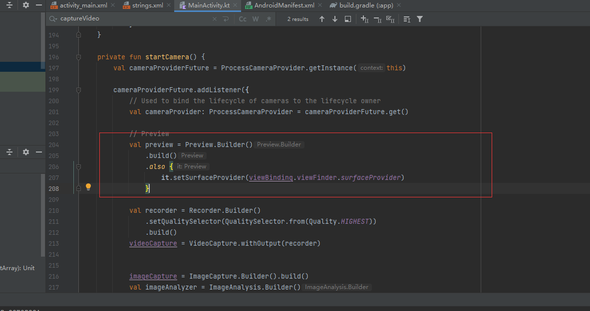

将 Preview + VideoCapture 用例绑定到生命周期相机。仍在 startCamera() 内，将 cameraProvider.bindToLifecycle() 调用替换为以下代码：

构建并运行项目。

运行结果如下：

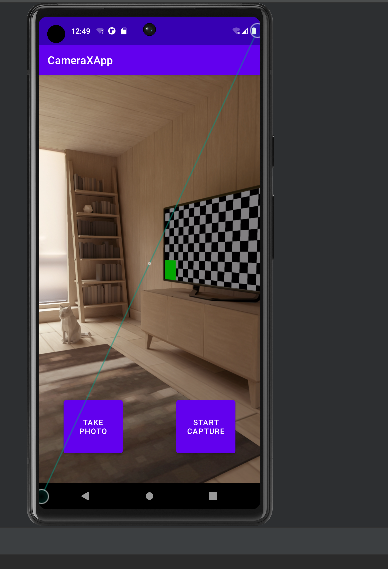

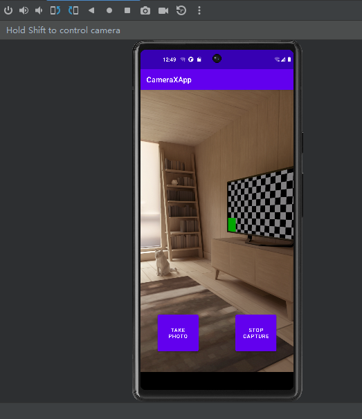

按stop后会有存储：

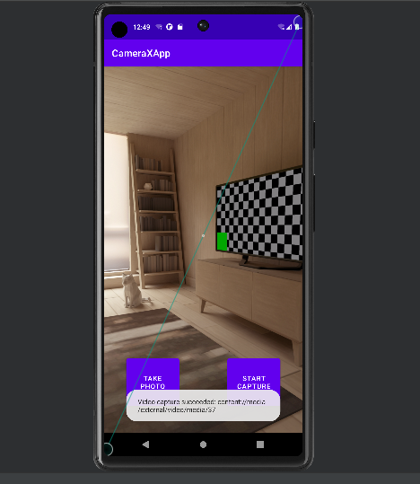
